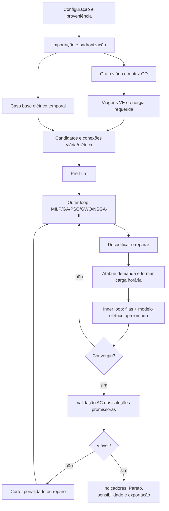

# Especificação metodológica e plano de desenvolvimento

## 1. Escopo, níveis e separação científica

O framework separa **metodologia**, **dados**, **hipóteses**, **resultados** e
**interpretação**. Cada execução declara um nível:

1. dados mínimos, rede e viagens sintéticas, aproximações explicitadas;
2. mobilidade e/ou rede elétrica parcialmente reais;
3. matriz OD, séries temporais e rede elétrica detalhada reais.

Um valor possui proveniência `measured`, `estimated` ou `synthetic`. Ausências
geram aviso, indicação de fonte possível (distribuidora, regulador, censo, OSM,
pesquisa OD) e método substituível; nunca conversão silenciosa em medição.

## 2. Arquitetura em camadas

| Camada | Responsabilidade | Entrada | Saída |
|---|---|---|---|
| configuração/importação | validar unidades, CRS, chaves e proveniência | YAML, CSV/GPKG, OpenDSS, pandapower | tabelas canônicas |
| viária | construir grafo dirigido e custos | OSM, arquivo ou NetworkX | grafo, tempos, caminhos |
| mobilidade/VE | OD real ou sintética e balanço energético | viagens, uso do solo, frota | eventos de recarga por tempo |
| candidatos | filtrar e conectar os dois domínios | POI, grafo, barras | candidato–nó–barra–trafo |
| elétrica | caso base e margens | rede, cargas horárias | diagnóstico e sensibilidades |
| otimização | localização, porte, atribuição e reforço | problema padronizado | solução/Fronte de Pareto |
| validação | fluxo AC, filas e acessibilidade | soluções promissoras | violações e correções |
| cenários/saída | comparação e rastreabilidade | resultados por semente | CSV/XLSX/GPKG/PNG/HTML |

Interfaces estáveis:

```python
optimizer.solve(problem, config) -> OptimizationResult
powerflow.run_power_flow(network, scenario) -> PowerFlowResult
evaluate_solution(x) -> ObjectivesAndConstraints
```

O `problem` conterá domínio das variáveis, restrições, objetivos e avaliadores de
mobilidade, eletricidade e economia. Assim, MILP, GA, PSO, GWO e NSGA-II não
alteram módulos externos. Motores pandapower, PYPOWER e LinDistFlow devolvem
`converged`, tensões, carregamentos, perdas ativa/reativa e violações.

## 3. Fluxograma



## 4. Dados necessários

* **viário:** nós/arestas, comprimento, velocidade, sentido, classe, capacidade,
  fluxo e restrições; faltas de velocidade podem usar mediana por classe, marcada
  como estimada;
* **mobilidade:** origem, destino, instante, quantidade, classe veicular, rota,
  SOC, bateria, consumo e energia; síntese pode combinar população, uso do solo,
  empregos, polos, contagens e fatores horários;
* **elétrico:** subestações, barras, linhas, chaves, transformadores, cargas,
  geração, limites e perfis; perfis ausentes são estimados por tipologia de
  consumidor, normalizados pela energia/pico conhecido e marcados;
* **candidatos:** geometria, disponibilidade de área, acesso, custo, nó viário,
  barra/transformador, distância de conexão e elegibilidade;
* **catálogos:** carregadores e transformadores comerciais por país/distribuidora,
  custos, eficiência, vida útil, OPEX e requisitos;
* **regulação/economia:** limites de tensão/carga, moeda, ano-base, taxa de
  desconto e valores do tempo, energia e perdas — todos configuráveis.

## 5. Formulação matemática

Índices: candidato \(i\), tecnologia \(k\), demanda/viagem \(d\), transformador
\(t\), classe comercial \(s\) e período \(h\).

Variáveis principais:

* \(x_i\in\{0,1\}\): abre estação;
* \(n_{ik}\in\mathbb Z_+\): carregadores do tipo `k`;
* \(a_{dih}\in[0,1]\) (ou binária): fração/atribuição da demanda;
* \(u_{ts}\in\{0,1\}\): escolha de classe do transformador;
* \(p_{ih}\ge0\), \(e^{uns}_{dh}\ge0\): demanda simultânea e não atendida.

Uma metaheurística codifica \(X=[x,n,u]\). `decode_solution` arredonda domínios,
remove carregador sem estação, limita quantidades, escolhe no máximo uma classe,
atribui demandas alcançáveis pelo menor custo generalizado e aumenta capacidade
ou registra demanda não atendida. Reparação é preferida; rejeição fica restrita a
erros estruturais e penalidades quantificam o restante.

### Restrições

\[
\sum_i a_{dih}+e^{uns}_{dh}/E_{dh}=1,\quad
a_{dih}\le x_i,\quad a_{dih}=0\;\text{se}\;dist^R_{di}>D_d^{max}
\]

\[
p_{ih}=\sum_d a_{dih}E_{dh}/(\Delta h\eta_k),\quad
p_{ih}\le\sum_k n_{ik}P_k\rho_k^{max},\quad n_{ik}\le M_{ik}x_i
\]

Incluem-se ainda orçamento/número de estações, estabilidade da fila, espera,
balanço de potência, tensão configurável, limite térmico de linhas, limite dos
transformadores e catálogo discreto. Distâncias são caminhos mínimos no grafo;
Euclidiana só é usada se registrada como aproximação.

### Transformadores

O pico VE vem da série temporal (não da soma das placas):

\[
S^{tot}_{th}=S^{base}_{th}+S^{EV}_{th},\quad
S_t^{req}=\max_h(S^{tot}_{th})/L_{max}.
\]

Potência ativa é convertida por fator de potência e eficiência consistentes. A
recomendação é a menor classe comercial \(S_s\ge S_t^{req}\). Se nenhuma classe
serve, classifica-se reforço estrutural. Reportam-se capacidade nominal,
disponível, requerida e recomendada separadamente.

### Filas

Na aproximação M/M/c, \(a=\lambda/\mu\), \(\rho=\lambda/(c\mu)<1\). Calculam-se
Erlang-C, \(W_q=P(wait)/(c\mu-\lambda)\) e \(L_q=\lambda W_q\). Taxa de serviço
depende de energia da sessão, potência limitada pelo veículo/carregador e
eficiência. Hipóteses exponenciais serão validadas posteriormente por simulação
de eventos discretos.

### Objetivos

O modo monetizado minimiza CAPEX anualizado de estação/carregador/conexão,
transformadores/alimentadores, perdas, viagem, espera e não atendimento. Outra
opção normaliza cada termo por referência documentada. Pesos permanecem no YAML
e passam por sensibilidade; unidades diferentes nunca são somadas diretamente.

O modo multiobjetivo mantém separados custo total, reforço, desvio, perdas,
demanda não atendida, espera e sobrecarga. NSGA-II devolve a Frente de Pareto;
nenhum ponto é automaticamente “melhor”. Hypervolume e diversidade são salvos.

## 6. Estratégia computacional

MILP com aproximação de rede fornece referência e *lower bound* em instâncias
pequenas. LinDistFlow é a aproximação preferencial para redes radiais; DC não é
usado indiscriminadamente. A validação final usa fluxo AC pandapower.

Para escala: pré-filtro, matriz de caminhos esparsa, cache por hash da solução,
vetorização, perfis horários agrupados, avaliações paralelas independentes,
aproximação nas primeiras gerações e AC apenas no conjunto promissor. Violações
AC retornam como cortes, penalidades adaptativas ou reparação e disparam nova
otimização.

Comparações usam mesmas instâncias e sementes, múltiplas execuções e registram
melhor/média/mediana/desvio, tempo, avaliações, fluxos, factibilidade, convergência
e robustez. GA, PSO e GWO cobrem paradigmas distintos; NSGA-II cobre Pareto; MILP
é referência transparente. Algoritmos adicionais só entram com hipótese clara.

## 7. Cenários, validações e indicadores

Os cenários mínimos são (A) mobilidade, (B) capacidade elétrica e (C) integrado.
Variam penetração VE, demanda, carregadores, limite de estações, carga convencional,
limite do transformador, custos, orçamento e QoS nos horizontes atual/curto/médio/
longo. A comparação mede o custo elétrico de locais viariamente atraentes e o
desvio/espera de locais eletricamente favoráveis.

Validações são independentes: testes de unidade/integração; cobertura e caminhos;
M/M/c versus simulação; caso base e AC pós-VE; comparação temporal; sensibilidades.
IEEE pequeno + vias sintéticas precede IEEE de distribuição + cidade real e,
por fim, redes reais. Coordenadas IEEE jamais são tratadas automaticamente como
ruas, e modificações do benchmark são registradas.

O primeiro benchmark incorporado é o IEEE 33 barras radial balanceado, com carga
PQ constante. A varredura backward/forward AC reproduz aproximadamente 0,9131 pu
na barra 18 e 202,68 kW de perdas no caso base. Os cinco ramos de interligação
normalmente abertos não pertencem à topologia radial carregada; essa opção está
registrada nos metadados, sem transformar coordenadas elétricas em vias.

Indicadores: atendimento, desvio, tempo, cobertura, energia, sessões, espera e
utilização; tensão extrema, perdas, carga de linhas/transformadores, sobrecargas
e capacidade adicional; CAPEX por componente, custo total, por veículo, por kWh
e marginal. Saídas incluem tabelas obrigatórias descritas no dicionário, mapa
integrado, perfis horários, convergência, Pareto e sensibilidade.

## 8. Sequência incremental e critérios de avanço

1. **Estrutura/configuração/modelos:** schema e proveniência; testes de config.
2. **Rede viária:** importadores e caminhos; teste de sentido e custo de rota.
3. **Mobilidade/VE:** OD e síntese; conservação de viagens/energia e semente.
4. **Rede elétrica:** adaptadores e caso base; benchmark de resultados conhecido.
5. **Mapeamento:** candidato–nó–barra–trafo; teste de CRS e distância máxima.
6. **Transformadores:** série temporal e catálogo; testes de limiar e extrapolação.
7. **Estações/filas:** catálogos e M/M/c; teste analítico e instabilidade.
8. **MILP pequeno:** balanços/capacidades; comparação por enumeração.
9. **GA/PSO/GWO:** codec/reparo/cache; factibilidade e reprodutibilidade.
10. **NSGA-II:** dominância/Pareto; frente sintética conhecida.
11. **AC iterativo:** cargas horárias e cortes; caso convergente/não convergente.
12. **Cenários/visualização/exportação:** esquema e artefatos; teste ponta a ponta.
13. **Benchmarks e análise científica:** múltiplas sementes e estatística.

Cada etapa só avança quando os testes listados passam e as aproximações aparecem
no manifesto da execução.

### Implementação de referência disponível

O benchmark IEEE 33 inclui agora uma primeira otimização inteira funcional. Cinco
candidatos sintéticos recebem contagens discretas de carregadores; cada solução
é reparada, tem a demanda agregada atribuída proporcionalmente à capacidade e é
avaliada por fluxo AC. A função monetiza CAPEX anualizado e perdas incrementais e
penaliza demanda não atendida e tensão fora dos limites. Uma enumeração completa
fornece o ótimo global da instância pequena, contra o qual o GA reprodutível é
testado. Essa etapa valida o outer/inner loop, mas ainda não inclui rede viária,
OD, fila, cronologia ou transformadores explícitos e não constitui resultado
urbano.

## 9. Estrutura sugerida do artigo

Introdução e lacuna; questão/hipóteses; revisão; arquitetura e dados; formulação;
métodos de solução; casos IEEE e estudo urbano; protocolo de validação; resultados
de mobilidade/elétricos/econômicos; comparação A/B/C; benchmark de algoritmos;
sensibilidade e limitações; conclusões, reprodutibilidade e trabalhos futuros.
